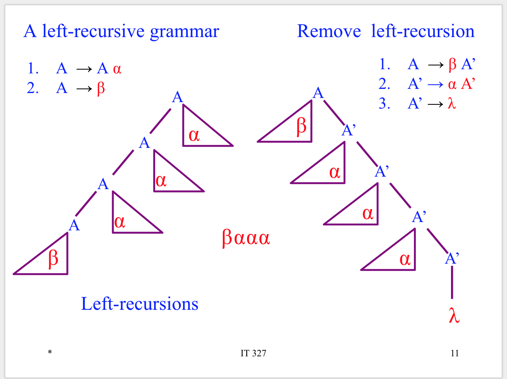

# Grammar and Parsing

## Left recursion

Recursive Descent Parsers cannot handle left recursion. We identify left recursions in the grammar just by looking at it. See following photo.

### Removing left recursion

The following diagrams show the process of eliminating left recursion to allow for recursive descent parsing.

### Indirect left-recursions

The following diagram shows an example of indirect left recursion.

### Removing indirect left recursions

The following algorithm will remove indirect left recursion.

##  Condition for being an LL(1) grammar

A predictive parser can only be built for an LL(1) grammar. A grammar is not
LL(1) if it is:

1. Left recursive, or
2. Not left factored

## First and Follow Sets

To build the table, we must must compute FIRST and FOLLOW sets for the grammar.

### Rules for First Sets

1. If X is a terminal then First(X) is just X!
2. If there is a Production X → ε then add ε to first(X)
3. If there is a Production X → Y1Y2..Yk then add first(Y1Y2..Yk) to first(X)
4. First(Y1Y2..Yk) is either
    1. First(Y1) (if First(Y1) doesn't contain ε)
    2. OR (if First(Y1) does contain ε) then First (Y1Y2..Yk) is everything in First(Y1) <except for ε > as well as everything in First(Y2..Yk)
    3. If First(Y1) First(Y2)..First(Yk) all contain ε then add ε to First(Y1Y2..Yk) as well.

### Rules for Follow Sets

1. First put $ (the end of input marker) in Follow(S) (S is the start symbol)
2. If there is a production A → aBb, (where a can be a whole string) then everything in FIRST(b) except for ε is placed in FOLLOW(B).
3. If there is a production A → aB, then everything in FOLLOW(A) is in FOLLOW(B)
4. If there is a production A → aBb, where FIRST(b) contains ε, then everything in FOLLOW(A) is in FOLLOW(B)
