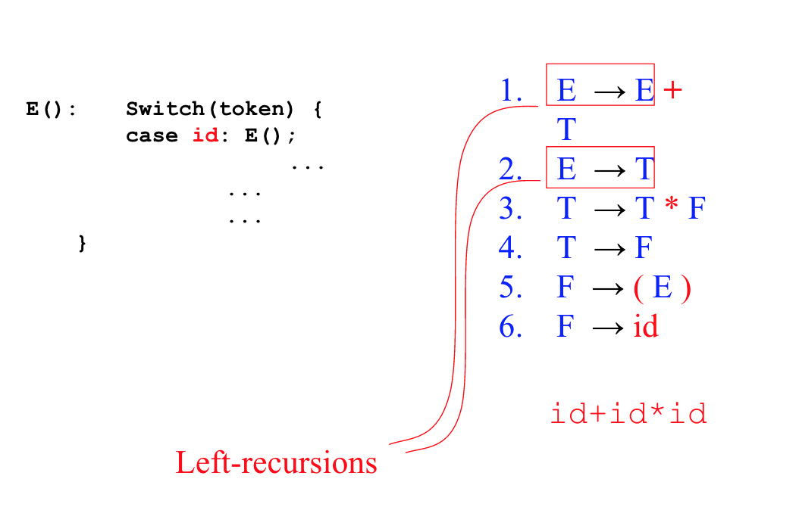

# Week 3

## Left recursion

Recursive Descent Parsers cannot handle left recursion. We identify left recursions in the grammar just by looking at it. See following photo.

### Removing left recursion

The following diagrams show the process of eliminating left recursion to allow for recursive descent parsing.

### Indirect left-recursions

The following diagram shows an example of indirect left recursion.

### Removing indirect left recursions

The following algorithm will remove indirect left recursion.

